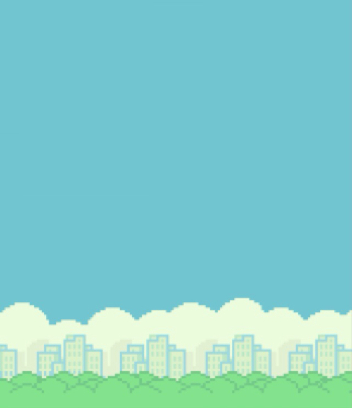
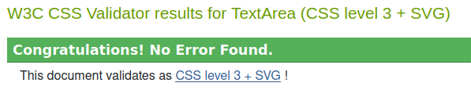

<div align="center">
  
</div>
<div align="center">
  
</div>

[Flappy Bird!](https://theblep.github.io/Flappy-Bird/) is a simple and addictive browser game, replicating the classic Flappy Bird experience. Built using HTML, CSS, and JavaScript, it allows users to test their reflexes and enjoy a retro gaming vibe. The goal is to navigate the bird through obstacles without crashing. The minimalist design mimiks retro in browser games from the 2010s while still providing a fun experiance. 

## Table of Contents
1. <details open>
    <summary><a href="#ux">UX</a></summary>

    <ul>
    <li><details>
    <summary><a href="#goals">Goals</a></summary>

    - [Visitor Goals](#visitor-goals)
    - [Business Goals](#business-goals)
    - [User Stories](#user-stories)
    </details></li>

    <li><details>
    <summary><a href="#visual-design">Visual Design</a></summary>

    - [Wireframes](#wireframes)
    - [Fonts](#fonts)
    - [Colors](#colors)
    - [Images](#images)
    - [Styling](#styling)
    </details></li>
    </ul>
</details>

2. <details open>
    <summary><a href="#features">Features</a></summary>

    <ul>
    <!-- <li><details>
    <summary><a href="#page-elements">Page Elements</a></summary>

    - [All Pages](#all-pages)
    - [Index Page](#index-page)
    - [Gallery Page](#gallery-page)
    - [Contact Page](#contact-page)
    </details></li>

    <li><details>
    <summary><a href="#additional-features">Additional Features</a></summary>

    - [Image Loading Blur](#image-loading-blur)
    - [Email](#email)
    </details></li> -->

    <li><details>
    <summary><a href="#feature-ideas">Feature Ideas</a></summary>

    - [Basic](#basic)
    - [Content](#content)
    </details></li>
    </ul>
</details>

3. <details open>
    <summary><a href="#technologies-used">Technologies Used</a></summary>

    - [Languages](#languages)
    - [Frameworks](#frameworks)
    - [Libraries](#libraries)
    - [Platforms](#platforms)
    - [Other Tools](#other-tools)
</details>

4. <details open>
    <summary><a href="#testing">Testing</a></summary>

    <ul>
    <li><details>
    <summary><a href="#methods">Methods</a></summary>

    - [Validation](#validation)
    - [General Testing](#general-testing)
    - [Mobile Testing](#mobile-testing)
    - [Desktop Testing](#desktop-testing)
    </details></li>

    <li><details>
    <summary><a href="#bugs">Bugs</a></summary>

    - [Known Bugs](#known-bugs)
    - [Fixed Bugs](#fixed-bugs)
    </details></li>
    </ul>
</details>

5. <details open>
    <summary><a href="#deployment">Deployment</a></summary>

    <ul>
    <li><details>
    <summary><a href="#local-deployment">Local Deployment</a></summary>

    - [Local Preparation](#local-preparation)
    - [Local Instructions](#local-instructions)
    </details></li>

    <li><details>
    <summary><a href="#github-deployment">Github Deployment</a></summary>

    - [Github Preparation](#github-preparation)
    - [Github Instructions](#github-instructions)
    </details></li>
    </ul>
</details>

6. <details open>
    <summary><a href="#credit-and-contact">Credit and Contact</a></summary>

    - [Content](#content)
    - [Contact](#contact)
</details>

----

# UX
## Goals
### Visitor Goals

The target audience for the "Flappy Bird Game" website includes:

- Casual gamers looking for a quick and fun experience.
- Fans of the original Flappy Bird game seeking a nostalgic experience.
- Developers curious about a simple JavaScript-based game implementation.
- Individuals exploring minimalist game design and mechanics.

User goals are:

- Play a functional and enjoyable browser-based game.
- Experience responsive and smooth gameplay on both desktop and mobile devices.
- Easily restart the game on gameover.
- Enjoy a visually appealing yet distraction-free game interface.

The "Flappy Bird Game" fulfills these needs by:

- Providing an intuitive interface and controls.
- Offering simple yet challenging gameplay.
- Maintaining a clean and focused design to enhance user immersion.
- Supporting various devices with responsive design.

#### Business Goals

The Business Goals of the "Flappy Bird Game" website are:

- Showcase a basic game implementation using JavaScript for educational purposes.
- Attract users interested in casual gaming.
- Potentially generate revenue through ads or premium features in the future.
- Provide a portfolio example for developers.


### User Stories

1. As a casual gamer, I expect the game to be easy to access and play.
2. As a fan of Flappy Bird, I expect the gameplay to replicate the original experience while offering a smooth interface.
3. As a developer, I expect to explore the game mechanics and source code.
4. As a user on mobile, I expect the game to be responsive and enjoyable on touchscreens.
5. As a beginner, I expect clear instructions on how to start and play the game.
6. I would like to easily restart the game without refreshing the page.


## Visual Design
<div align="center">
  
  
</div>

### Frameworks

A tuttorial to understand the logic behind flappy bird was used as a base for the project. The rest was done using various sources including Chat GPT for boiler plates and W3C for functions/elements as well as timer implementation.

### Fonts
<div align="center">
  
</div>

- The primary font, Arial was chosen because it seemed to fit well with the minimal look of the website.
- The secondary font, sans-serif was chosen due to its default nature in HTML as well as to simplify the development.

### Colors
<div align="center">
  
</div>

- Background: Sky blue for a vibrant and inviting atmosphere on both the welcome page and the game page itself
- Obstacles, sky, bird and ground: The original color scheme of the game was replicated as best as possible.
- Welcome page: Designed to mimik the game style and create a visual segway, the welcome page uses similar colors to the game page.


### Images
<div align="center">
  
  
  
  
</div>

- The game uses simple 2D graphics created with HTML canvas. These graphics are taken from the [tutorial repository](https://github.com/kubowania/flappy-bird)
- there was thought to change the game to "flappy Kirby" to show my love for the game character.


### Styling
- CSS was used alot to maintain a minimalist design and allow different screen sizes.
- JavaScript handles dynamic styling and animations during gameplay.

----

# Features
## Gameplay Elements

### Game Loop

- The game operates on a continuous loop, updating the bird's position, detecting collisions, and rendering frames.

### Obstacles

- The JS Randomly generates green pipes with varying gaps using an internal timer.

### Restart Functionality

- A restart button allows players to immediately start a new game.

### Mobile Compatibility

- Responsive controls ensure a smooth experience on all device sizes.

## Feature Ideas
- Sound: Adding sound would add a whole new sense to the game, making it more amusing. but there would also have to be a mute button.
- different difficulties: Different difficulties, perhaps on the welcome page itself, to give the player an initial challange!
- Scoring: This is one i wish i had had the time to implement, this would perhaps be the first feature that would need to be implemented to drastically improve game play and give the player an incentive to keep playing.
- Different levels: As the player progresses, levels could be implemented to gradually increase the difficulty, or simply a liniar increase in difficulty with time, with distance being the end goal.
- different characters: This would be something that could be implemented ot give the player customization of the game. different characters, such as Kirby could be chosen on the welcome page before the game starts.
- In the end there are alot of upgrades to this simple game that could be implemented.

# Technologies Used
## Languages
- [HTML](w3.org/standards/webdesign/htmlcss)
    * Page markup.
- [CSS](w3.org/standards/webdesign/htmlcss)
    * Styling.
- [JavaScript](https://developer.mozilla.org/en-US/docs/Web/JavaScript)
  - Game logic and interactivity.

## Libraries
- This game was made completely without libraries.

## Platforms
- [Github](https://github.com/)
    * Storing code remotely and deployment.
- [Gitpod](https://gitpod.io/)
    * IDE for project development.

## Other Tools
- [Mockup Generator](http://techsini.com/multi-mockup/)
    * For device mockup images.
- [Coolors](https://coolors.co/)
    * Creating color pallettes.

----

# Testing
## Methods
### Validation
- HTML has been validated with [W3C HTML5 Validator](https://validator.w3.org/). No errors
<div align="center">
  
</div>

- CSS has been validated with [W3C CSS Validator](https://jigsaw.w3.org/css-validator/) No errors

<div align="center">
  
</div>

- JavaScript has been validated with [JSHint](https://jshint.com/) No errors
- Accessabilit validated with [Pagespeed](https://pagespeed.web.dev/) 100% accessabiltiy on all pages
<div align="center">
  
</div>

### General Testing
- Each time a feature was added, all the functions were tested to see if there was an impact.
- All forms have validation and will not submit without the proper information.
- The game was stress tested by multiple people and any bugs found have been fixed

### Mobile and Desktop Testing
- I tested the site personally on my Android device, going through the entire process, checking buttons, functions, checking out, etc. I was personally unable to test on iOS.
- The site was developed on Linux, Firefox.
- Testing on Chrome, Edge and Firefox on Windows and Linux systems has shown full functionality.
- Internet Explorer was not tested.

## Bugs
### Known Bugs
- On some mobile devices the playing feild may not be entierly centered, leaving a small gap on one side.
- Player goal is lacking.

### Fixed Bugs
- when two pipes where on the play screen at endgame, the most left pipe would remain in frame and this would escalate with every restart.
- Bird would fall through floor on restart
- jumping was allowed even after endgame
- There are many many many more bugs that where fixed, especially after stress testing by friends.


----

# Deployment
## Local Deployment
### Local Preparation
**Requirements:**
- An IDE of your choice, such as [Gitpod](https://www.gitpod.io/)

### Local Instructions
1. Clone the repository with:
    ```
    git clone https://theblep.github.io/Flappy-Bird/
    ```
    To disconnect it from the master repository, use:
    ```
    git remote rm origin
    ```
2. Open your IDE and choose the base directory.
3. Run the project with your chosen method. You can drop index.html into a web browser and it should run fine, open a local port and access it or, if you have python installed, run it on an HTTP server with python with a command such as:
    ```
    python3 -m http.server
    ```
4. Enjoy the site!

## Github Deployment
### Github Preparation
- It is possible to copy or clone the repository directly for deployment.
**Requirements:**
- A free GitHub account.

### Github Instructions
1. Log in to your GitHub account.
navigate to [https://github.com/TheBlep/Flappy-Bird](https://github.com/TheBlep/Flappy-Bird).
1. You can set up your own repository and copy or clone it, or you fork the repository.
2. `git add`, `git commit` and `git push` to a GitHub repository, if necessary.
3. GitHub pages will update from the master branch by default.
4. Go to the **Settings** page of the repository.
5. Scroll down to the **Github Pages** section.
7. Select the Master Branch as the source and **Confirm** the selection.
8. Wait a minute or two and it should be live for viewing. See my own [here](https://theblep.github.io/Flappy-Bird/).

## Credits and Contact
### Content
Much of the game logic was taken from the following [tutorial](https://www.youtube.com/watch?v=8xPsg6yv7TU).
The game images where taken from the attached [github page](https://github.com/kubowania/flappy-bird).
The boiler plate for the welcome page was generated in ChatGPT4.

### Contact
Please feel free to contact me via github.